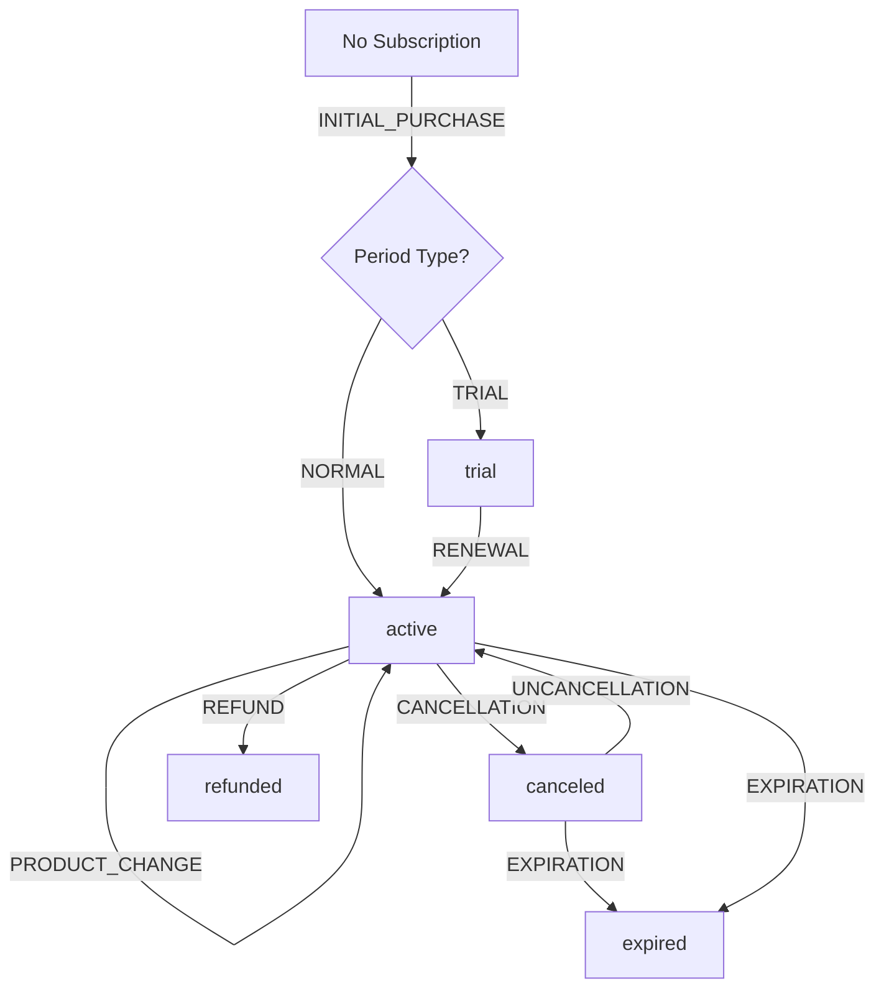

# RevenueCat Integration - Complete Implementation

**Status**: ✅ **READY FOR TESTING**  
**Date**: October 26, 2025  
**Branch**: `feat/backend-vercel-only-clean`

---

## 📊 Overview

Fully implemented RevenueCat webhook integration that mirrors subscription state into EverReach backend, providing:
- Real-time subscription status updates
- Trial, active, canceled, expired, and refunded states
- Support for iOS App Store and Google Play Store
- HMAC signature verification for security
- Idempotency for duplicate event handling
- Automatic entitlements mapping

---

## 🏗️ Architecture

### Components Created

1. **Database Migration** (`supabase/migrations/20251026172100_revenuecat_subscriptions.sql`)
   - `user_subscriptions` table - Stores subscription state
   - `revenuecat_webhook_events` table - Tracks processed events (idempotency)
   - Helper functions for querying active subscriptions
   - RLS policies for security

2. **Webhook Processing Library** (`lib/revenuecat-webhook.ts`)
   - Signature verification (HMAC SHA256)
   - Event type handling (7 event types)
   - Status derivation logic
   - Entitlements mapping

3. **Webhook Endpoint** (`app/api/v1/billing/revenuecat/webhook/route.ts`)
   - POST endpoint for RevenueCat webhooks
   - Request validation
   - Error handling with retry support

4. **Updated Entitlements Endpoint** (`app/api/v1/me/entitlements/route.ts`)
   - Reads from subscription data
   - Returns tier, features, and status

5. **Comprehensive Test Suite** (`test/revenuecat-webhook.mjs`)
   - 10 test scenarios
   - All event types covered
   - Signature verification tests
   - Idempotency tests

---

## 📁 Database Schema

### user_subscriptions Table

```sql
CREATE TABLE user_subscriptions (
  id UUID PRIMARY KEY,
  user_id UUID NOT NULL REFERENCES auth.users(id),
  
  -- RevenueCat IDs
  original_transaction_id TEXT NOT NULL UNIQUE,
  transaction_id TEXT NOT NULL,
  product_id TEXT NOT NULL,
  
  -- Status
  status TEXT CHECK (status IN ('trial', 'active', 'canceled', 'expired', 'refunded')),
  platform TEXT CHECK (platform IN ('app_store', 'play')),
  environment TEXT CHECK (environment IN ('SANDBOX', 'PRODUCTION')),
  
  -- Timing
  purchased_at TIMESTAMPTZ,
  current_period_end TIMESTAMPTZ,
  trial_ends_at TIMESTAMPTZ,
  canceled_at TIMESTAMPTZ,
  expires_at TIMESTAMPTZ,
  
  -- Tracking
  last_event_id TEXT,
  last_event_type TEXT,
  last_event_at TIMESTAMPTZ,
  
  created_at TIMESTAMPTZ DEFAULT NOW(),
  updated_at TIMESTAMPTZ DEFAULT NOW()
);
```

### revenuecat_webhook_events Table

```sql
CREATE TABLE revenuecat_webhook_events (
  event_id TEXT PRIMARY KEY,
  event_type TEXT NOT NULL,
  app_user_id TEXT NOT NULL,
  product_id TEXT,
  processed_at TIMESTAMPTZ DEFAULT NOW(),
  payload JSONB NOT NULL,
  created_at TIMESTAMPTZ DEFAULT NOW()
);
```

---

## 🔄 Webhook Flow

1. **RevenueCat sends webhook** → `POST /api/v1/billing/revenuecat/webhook`
2. **Verify HMAC signature** using `REVENUECAT_WEBHOOK_SECRET`
3. **Check idempotency** - Has this `event.id` been processed?
4. **Process event** - Update or create subscription record
5. **Mark as processed** - Store event ID to prevent duplicates
6. **Return 200 OK** - Confirms processing to RevenueCat

---

## 🎯 Supported Event Types

### Core Events (Required)

| Event Type | Description | Status |
|------------|-------------|--------|
| `INITIAL_PURCHASE` | First purchase (trial or paid) | `trial` or `active` |
| `RENEWAL` | Subscription renewed | `active` |
| `CANCELLATION` | User canceled (access until period end) | `canceled` |
| `EXPIRATION` | Subscription expired | `expired` |
| `REFUND` | Purchase refunded (immediate access removal) | `refunded` |
| `PRODUCT_CHANGE` | Upgraded/downgraded product | `active` |
| `UNCANCELLATION` | User reactivated canceled subscription | `active` |

### Optional Events

| Event Type | Description |
|------------|-------------|
| `BILLING_ISSUE` | Payment failed (will expire if not resolved) |
| `SUBSCRIBER_ALIAS` | User ID changed |

---

## 🔐 Security

### Signature Verification

RevenueCat signs all webhooks with HMAC SHA256:

```typescript
// Verify signature
const hmac = crypto.createHmac('sha256', WEBHOOK_SECRET);
hmac.update(rawBody);
const expectedSignature = hmac.digest('hex');

// Constant-time comparison
const isValid = crypto.timingSafeEqual(
  Buffer.from(signature),
  Buffer.from(expectedSignature)
);
```

### Idempotency

Events are de-duplicated by `event.id`:
- Store processed event IDs in `revenuecat_webhook_events`
- Automatic cleanup after 48 hours
- Duplicate events return `200 OK` with `{ duplicate: true }`

---

## 🚀 Setup Guide

### 1. Environment Variables

Add to `.env`:

```bash
# RevenueCat Webhook Secret
# Get from: https://app.revenuecat.com/settings/integrations
REVENUECAT_WEBHOOK_SECRET=your_webhook_secret_here
```

### 2. Run Database Migration

```powershell
# Apply migration
cd backend-vercel
npx supabase db push

# Or via SQL Editor
# Copy content from: supabase/migrations/20251026172100_revenuecat_subscriptions.sql
# Paste into: https://supabase.com/dashboard/project/utasetfxiqcrnwyfforx/sql/new
# Run
```

### 3. Configure RevenueCat Webhook

1. Go to RevenueCat Dashboard: https://app.revenuecat.com
2. Navigate to **Integrations** → **Webhooks**
3. Add new webhook:
   - **URL**: `https://ever-reach-be.vercel.app/api/v1/billing/revenuecat/webhook`
   - **Secret**: Generate and save to `.env` as `REVENUECAT_WEBHOOK_SECRET`
   - **Events**: Select all events (or minimum: INITIAL_PURCHASE, RENEWAL, EXPIRATION, CANCELLATION, REFUND)
4. Test webhook from dashboard

### 4. Deploy to Vercel

```powershell
# Deploy
vercel --prod

# Or auto-deploy via Git
git push origin feat/backend-vercel-only-clean
```

---

## 🧪 Testing

### Run E2E Tests

```powershell
# Run all RevenueCat webhook tests
.\scripts\test-revenuecat-webhook.ps1

# Or directly
node test/revenuecat-webhook.mjs
```

### Test Coverage

✅ **10 comprehensive tests**:
1. Signature verification (valid, invalid, missing)
2. INITIAL_PURCHASE (trial)
3. RENEWAL
4. CANCELLATION
5. EXPIRATION
6. REFUND
7. PRODUCT_CHANGE
8. Idempotency (duplicate events)
9. Invalid event data
10. Entitlements integration

### Manual Testing

Use RevenueCat dashboard to send test webhooks:
1. Go to **Integrations** → **Webhooks** → Your webhook
2. Click **Send test event**
3. Select event type (e.g., INITIAL_PURCHASE)
4. Verify in backend logs and database

---

## 📱 Mobile App Integration

### Configure Purchases SDK

#### iOS (Swift)

```swift
import RevenueCat

// In AppDelegate or App struct
func application(_ application: UIApplication, didFinishLaunchingWithOptions...) {
    Purchases.logLevel = .debug
    Purchases.configure(withAPIKey: "appl_YOUR_API_KEY",
                       appUserID: userId) // Use EverReach user ID
}
```

#### Android (Kotlin)

```kotlin
import com.revenuecat.purchases.Purchases
import com.revenuecat.purchases.PurchasesConfiguration

// In Application.onCreate()
Purchases.configure(
    PurchasesConfiguration.Builder(this, "goog_YOUR_API_KEY")
        .appUserID(userId) // Use EverReach user ID
        .build()
)
```

### Check Entitlements in App

```swift
// iOS
Purchases.shared.getCustomerInfo { (customerInfo, error) in
    if customerInfo?.entitlements["core"]?.isActive == true {
        // User has core entitlement
    }
}
```

```kotlin
// Android
Purchases.sharedInstance.getCustomerInfo({ customerInfo, error ->
    if (customerInfo.entitlements["core"]?.isActive == true) {
        // User has core entitlement
    }
})
```

### Use Backend Entitlements

The mobile app should also call `/v1/me/entitlements` for server-verified entitlements:

```typescript
const response = await fetch('/v1/me/entitlements', {
  headers: { 'Authorization': `Bearer ${jwt}` }
});

const { tier, subscription_status, features } = await response.json();

// Use tier and features to control UI
if (tier === 'pro') {
  // Enable pro features
}
```

---

## 📖 API Reference

### Webhook Endpoint

**POST** `/api/v1/billing/revenuecat/webhook`

**Headers**:
- `Content-Type: application/json`
- `X-RevenueCat-Signature: <hmac_signature>`

**Request Body**:
```json
{
  "event": {
    "type": "INITIAL_PURCHASE",
    "id": "evt_123",
    "app_user_id": "<USER_ID>",
    "product_id": "com.everreach.core.monthly",
    "entitlement_ids": ["core"],
    "environment": "PRODUCTION",
    "purchased_at_ms": 1730000000000,
    "expiration_at_ms": 1730604800000,
    "period_type": "NORMAL",
    "store": "APP_STORE",
    "transaction_id": "200000000000000",
    "original_transaction_id": "100000000000000"
  }
}
```

**Success Response** (200):
```json
{
  "ok": true,
  "processed": true,
  "event_id": "evt_123",
  "user_id": "<USER_ID>",
  "subscription": {
    "status": "active",
    "product_id": "com.everreach.core.monthly",
    "current_period_end": "2025-11-02T12:00:00.000Z",
    "platform": "app_store"
  },
  "request_id": "rc_1730000000_abc123"
}
```

**Duplicate Response** (200):
```json
{
  "ok": true,
  "duplicate": true,
  "processed": false,
  "event_id": "evt_123",
  "user_id": "<USER_ID>",
  "request_id": "rc_1730000000_abc123"
}
```

**Error Responses**:
- `401` - Invalid signature
- `400` - Invalid JSON or missing required fields
- `500` - Processing error (RevenueCat will retry)

### Entitlements Endpoint

**GET** `/v1/me/entitlements`

**Headers**:
- `Authorization: Bearer <jwt_token>`

**Response** (200):
```json
{
  "tier": "core",
  "subscription_status": "active",
  "trial_ends_at": null,
  "current_period_end": "2025-11-26T00:00:00.000Z",
  "payment_platform": "apple",
  "features": {
    "compose_runs": 500,
    "voice_minutes": 120,
    "messages": 1000,
    "contacts": 500
  }
}
```

---

## 🎚️ Tier & Feature Mapping

### Tier Mapping

Product IDs → Tiers:
- `*.core.*` → `core`
- `*.pro.*` → `pro`
- `*.team.*` → `team`
- Default → `free`

### Features by Tier

```typescript
const features = {
  free: {
    compose_runs: 50,
    voice_minutes: 30,
    messages: 200,
    contacts: 100,
  },
  core: {
    compose_runs: 500,
    voice_minutes: 120,
    messages: 1000,
    contacts: 500,
  },
  pro: {
    compose_runs: 1000,
    voice_minutes: 300,
    messages: 2000,
    contacts: -1, // unlimited
  },
  team: {
    compose_runs: -1,
    voice_minutes: -1,
    messages: -1,
    contacts: -1,
    team_members: 10,
  },
};
```

---

## 🔍 Monitoring & Debugging

### Check Subscription Status

```sql
-- Get user's active subscription
SELECT * FROM user_subscriptions
WHERE user_id = 'your-user-id'
  AND status IN ('trial', 'active', 'canceled')
  AND current_period_end > NOW()
ORDER BY current_period_end DESC;

-- Get all webhook events for a user
SELECT * FROM revenuecat_webhook_events
WHERE app_user_id = 'your-user-id'
ORDER BY created_at DESC;
```

### View Logs

```powershell
# Vercel logs
vercel logs --prod

# Filter for RevenueCat
vercel logs --prod | Select-String "RevenueCat"
```

### Common Issues

**Issue**: Webhook receives 401 (Invalid signature)
- **Fix**: Check `REVENUECAT_WEBHOOK_SECRET` matches RevenueCat dashboard

**Issue**: Subscription not updating
- **Fix**: Check webhook URL is correct and accessible
- **Fix**: Verify RLS policies allow service role to write

**Issue**: Duplicate events creating errors
- **Fix**: Ensure `revenuecat_webhook_events` table exists and has event ID

---

## 📊 Status Transitions



---

## ✅ Implementation Checklist

- [x] Database migration created
- [x] Webhook processing library implemented
- [x] Webhook endpoint created
- [x] Signature verification added
- [x] Idempotency checks implemented
- [x] All 7 event types handled
- [x] Entitlements endpoint updated
- [x] Comprehensive tests written (10 scenarios)
- [x] Test runner script created
- [x] Complete documentation written
- [ ] Database migration applied to production
- [ ] Webhook configured in RevenueCat dashboard
- [ ] Tests passing in production
- [ ] Mobile apps configured with user IDs

---

## 🚧 Next Steps

1. **Apply Migration**
   ```powershell
   npx supabase db push
   ```

2. **Configure RevenueCat Webhook**
   - Add webhook URL in dashboard
   - Save webhook secret to `.env`

3. **Run Tests**
   ```powershell
   .\scripts\test-revenuecat-webhook.ps1
   ```

4. **Deploy**
   ```powershell
   vercel --prod
   ```

5. **Configure Mobile Apps**
   - Set `appUserID` to EverReach user ID
   - Test purchases in sandbox

6. **Monitor**
   - Check webhook deliveries in RevenueCat dashboard
   - Verify subscription data in database
   - Test entitlements endpoint

---

## 📝 Files Created

| File | Lines | Purpose |
|------|-------|---------|
| `supabase/migrations/20251026172100_revenuecat_subscriptions.sql` | ~200 | Database schema |
| `lib/revenuecat-webhook.ts` | ~350 | Processing logic |
| `app/api/v1/billing/revenuecat/webhook/route.ts` | ~150 | Webhook endpoint |
| `app/api/v1/me/entitlements/route.ts` | ~45 | Updated entitlements |
| `test/revenuecat-webhook.mjs` | ~600 | E2E tests |
| `scripts/test-revenuecat-webhook.ps1` | ~25 | Test runner |
| `REVENUECAT_IMPLEMENTATION.md` | ~800 | This file |

**Total**: ~2,170 lines of code + documentation

---

**Status**: ✅ **READY FOR DEPLOYMENT**  
**Next**: Apply migration → Configure webhook → Test → Deploy
