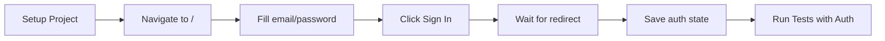

# Playwright Authentication Setup

Playwright tests run with real authentication, just like the agent tests.

## Prerequisites

You need the same environment variables used by agent tests:

```powershell
# Required for authentication
$env:TEST_EMAIL = "isaiahdupree33@gmail.com"
$env:TEST_PASSWORD = "your-password-here"

# Optional: Supabase credentials (if not in .env)
$env:SUPABASE_URL = "https://utasetfxiqcrnwyfforx.supabase.co"
$env:SUPABASE_ANON_KEY = "your-anon-key"
```

## How It Works

1. **Global Setup** (`auth.setup.ts`):
   - Runs before all tests
   - Signs in via your app's UI
   - Saves authenticated state (cookies, localStorage) to `test/frontend/.auth/user.json`

2. **Test Execution**:
   - All tests use the saved auth state
   - No need to sign in for each test
   - Tests run as authenticated user

3. **User Account**:
   - Email: `isaiahdupree33@gmail.com` (default, matches agent tests)
   - Override with `TEST_EMAIL` env var if needed

## Running Tests

```bash
# Start Expo web (in another terminal)
npx expo start --web --port 8081

# Run Playwright tests (auto-authenticates first)
npx playwright test -c test/frontend/playwright.config.ts
```

## Authentication Flow



## Troubleshooting

### "TEST_PASSWORD environment variable is required"
Set the password env var:
```powershell
$env:TEST_PASSWORD = "your-actual-password"
```

### Authentication fails
- Check that the user exists in Supabase
- Verify TEST_EMAIL and TEST_PASSWORD are correct
- Check Expo web is running on port 8081
- Look at screenshot in test-results/

### Tests fail after auth
- The saved auth state (`test/frontend/.auth/user.json`) might be stale
- Delete the file and run tests again to re-authenticate

## Auth State File

The auth state is saved to:
```
test/frontend/.auth/user.json
```

This file contains:
- Cookies (session tokens)
- localStorage (including Supabase auth)
- sessionStorage

**Do not commit this file** - it's in .gitignore

## Matching Agent Tests

This setup mirrors the agent test authentication in `test/agent/_shared.mjs`:
- Same email: `TEST_EMAIL`
- Same password: `TEST_PASSWORD`
- Same Supabase sign-in flow
- Consistent test user across all test suites
